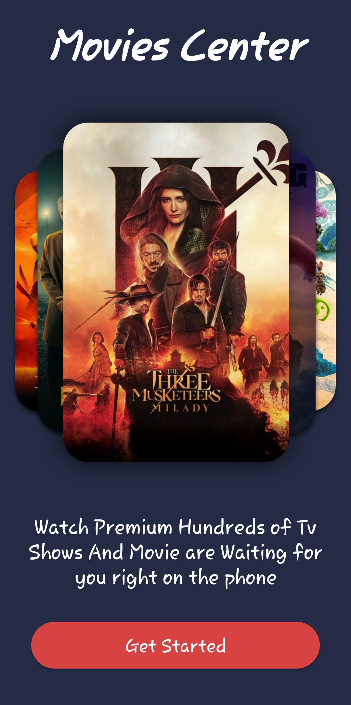
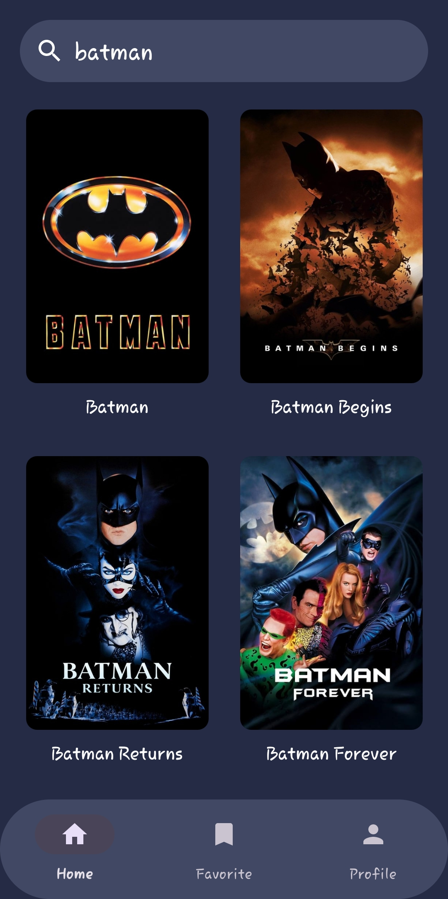
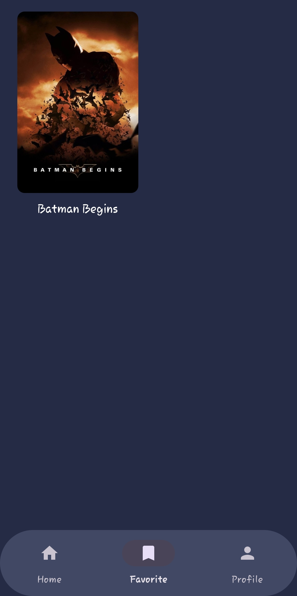

# Clean Architecture Movies App

### Overview

Shows list of movies is fetched from an API and stored locally in a database for offline access.
Users can mark movies as favorites and search movies.

### Preview
<table align="start">
  <tr>
    <td align="center">
       
      <b>Welcome</b>
    </td>
    <td align="center">
       
      <b>Home</b>
    </td>
    <td align="center">
       
      <b>Detail</b>
    </td>
    <td align="center">
       
      <b>Favorite</b>
    </td>
  </tr>
</table>

## Tech Stack

- **Language**: Kotlin
- **Architecture**: Clean Architecture (Presentation, Domain, Data)
- **Modularization**:
    - Core module (Android Library)
    - Favorite feature (Dynamic Feature Module)
- **Reactive Programming**: RxJava (data flow + UI updates)
- **Dependency Injection**: Dagger Hilt
- **Navigation**: Jetpack Navigation Component
- **Networking**: Retrofit + OkHttp
- **JSON Parsing**: Gson
- **Image Loading**: Glide
- **Local Database**: Room (with SQLCipher encryption)
- **Security**:
    - Certificate Pinning (OkHttp)
    - Code Obfuscation (ProGuard/R8)
- **UI**: XML Layouts, ViewModel + RxJava
- **Performance**: LeakCanary, Code inspection
- **Extra Feature**: Search (RxJava)

### Before run app. Add this parameter on local.properties and fill.

HOSTNAME=api.themoviedb.org  
BASE_URL=https://api.themoviedb.org/3/  
IMAGE_URL=https://image.tmdb.org/t/p/w500  
API_KEY=  
CERTIFICATE_KEY=  
